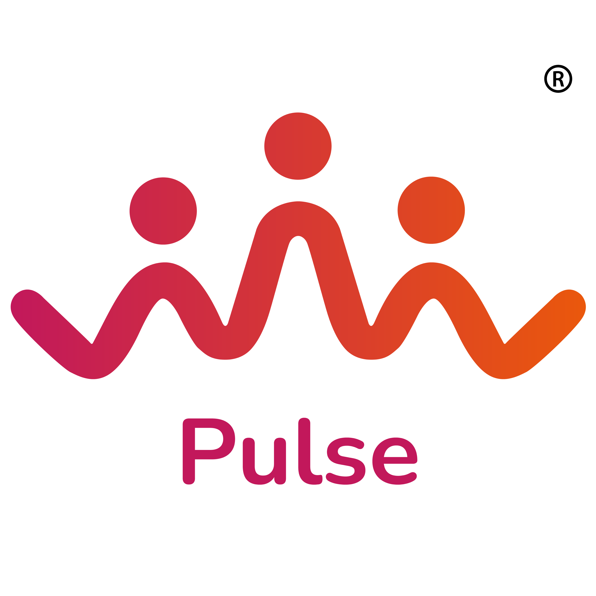

<p align="center">
  
</p>

<h1 align="center">BK Pulse</h1>

<p align="center">
  <strong>L'ERP qui va a votre rythme.</strong>
  <br />
  <em>Deploiement SAP Cloud en 8 semaines pour l'assurance, les mutuelles et le courtage.</em>
</p>

<p align="center">
  <a href="#-a-propos">A propos</a> ·
  <a href="#-sections">Sections</a> ·
  <a href="#%EF%B8%8F-tech-stack">Tech Stack</a> ·
  <a href="#-getting-started">Getting Started</a> ·
  <a href="#-design-system">Design</a> ·
  <a href="#-deployment">Deployment</a>
</p>

<p align="center">
  
  
  
  
  
  
</p>

<p align="center">
  
  
  
</p>

---

## 📌 A propos

**BK Pulse** est le site vitrine premium de BK Pulse (BK Partners Group), cabinet de conseil specialise dans le deploiement rapide d'ERP SAP Cloud pour le secteur de l'assurance, des mutuelles et du courtage.

Le site est concu comme une **landing page one-page haute conversion** — chaque section guide le visiteur du probleme a la solution, jusqu'au formulaire de contact Typeform.

> **Philosophie :** Pas de tunnel projet. Pas de complexite inutile. Juste de l'efficacite.

---

## 🏗 Sections

Le site se parcourt en scroll continu avec navigation par ancres :

```
╔══════════════════════════════════════════════════════════╗
║                                                          ║
║   🏄 NAVIGATION                                         ║
║   Fixed glass header · Progress indicator · Mobile menu  ║
║                                                          ║
╠══════════════════════════════════════════════════════════╣
║                                                          ║
║   🌊 HERO                                               ║
║   "L'ERP qui va a votre rythme"                         ║
║   Gradient blobs · Brand wave SVG · Dual CTAs            ║
║   Animated scroll indicator                              ║
║                                                          ║
╠══════════════════════════════════════════════════════════╣
║                                                          ║
║   ⚡ PROMESSE                                            ║
║   3 cards: Deploiement rapide · Standard · Zero lourdeur ║
║   Lucide icons · Hover lift · Stagger animations         ║
║                                                          ║
╠══════════════════════════════════════════════════════════╣
║                                                          ║
║   👥 POUR QUI                                            ║
║   Dirigeants · DAF · DSI                                 ║
║   Role-based value propositions · Gradient backgrounds   ║
║                                                          ║
╠══════════════════════════════════════════════════════════╣
║                                                          ║
║   8️⃣  BANNER                                             ║
║   Full-width gradient · "8 semaines" bold statement      ║
║   Wave SVG decorations                                   ║
║                                                          ║
╠══════════════════════════════════════════════════════════╣
║                                                          ║
║   ☁️  CLOUD SAP                                          ║
║   4 features grid: Metiers · Updates · Securite · IA     ║
║   Two-column layout · Icon badges                        ║
║                                                          ║
╠══════════════════════════════════════════════════════════╣
║                                                          ║
║   📋 METHODE                                             ║
║   Animated timeline: Diagnostic → Config → Go-Live       ║
║   Step connectors · Duration badges · Gradient accents   ║
║                                                          ║
╠══════════════════════════════════════════════════════════╣
║                                                          ║
║   📩 CTA FINAL                                           ║
║   "Votre ERP deploye en 8 semaines"                     ║
║   Embedded Typeform · 3 trust badges                     ║
║                                                          ║
╠══════════════════════════════════════════════════════════╣
║                                                          ║
║   🔻 FOOTER                                             ║
║   BK Partners Group · Navigation · Contact · Legal       ║
║                                                          ║
╚══════════════════════════════════════════════════════════╝
```

---

## ⚡️ Tech Stack

```
Framework        Next.js 14.2       App Router, Static Export
UI               React 18           Client Components
Styling          Tailwind CSS 3.4   Custom theme, gradients, animations
Animations       Framer Motion 12   Scroll-triggered, stagger, spring
Icons            Lucide React       Zap, Target, Rocket, Shield, Brain...
Forms            Typeform Embed     Lead capture, email notifications
Font             Nunito             300–900 weights via Google Fonts
Language         TypeScript 5       Strict mode
Build Output     Static HTML        ./out/ directory, zero server needed
Container        Docker + Nginx     Production-ready static serving
```

### Why These Choices?

| Choice | Reason |
|--------|--------|
| **Static export** | Zero server cost, CDN-friendly, instant loads |
| **No CMS** | Content is stable — hardcoded = fastest possible |
| **Typeform** | Beautiful forms without building a backend |
| **One file** | Entire site in `page.tsx` — easy to maintain and deploy |
| **Framer Motion** | Buttery smooth scroll animations, tiny bundle |

---

## 🎨 Design System

### Brand Identity

```
 ████████  Rose        #c2185b    Primary — CTAs, headings, identity
 ████████  Orange      #ea580c    Secondary — gradients, warm accents
 ░░░░░░░░  White       #ffffff    Backgrounds, cards, breathing room
 ▓▓▓▓▓▓▓▓  Dark        #1a1a2e    Footer, contrast text
```

### Signature Gradient

```css
background: linear-gradient(135deg, #c2185b, #ea580c);
```

Used across CTAs, banners, badges, text highlights, and decorative elements. The gradient flows from **passion** (rose) to **energy** (orange) — reflecting the brand promise of speed and transformation.

### Typography

| Element | Font | Weight | Style |
|---------|------|--------|-------|
| Headings | Nunito | 700-900 | Rounded, approachable |
| Body | Nunito | 400 | Clean readability |
| Captions | Nunito | 300 | Light, elegant |
| CTAs | Nunito | 700 | Bold, action-oriented |

### Animation Language

| Animation | Usage | Timing |
|-----------|-------|--------|
| `fadeUp` | Section entrances | 0.6s ease-out |
| `blurUp` | Soft content reveals | 0.5s with 4px blur |
| `float` | Decorative blobs | 6s infinite |
| `drift` | Background circles | 20s infinite |
| `wave-flow` | Brand wave patterns | 25s linear |
| `gradient-shift` | Text shimmer | 3s ease-in-out |
| Stagger | Card groups | 0.15s delay between items |

---

## 🚀 Getting Started

### Prerequisites

- **Node.js** >= 18
- **pnpm** (recommended) or npm

### Development

```bash
# Clone
git clone <repo-url> bk-pulse
cd bk-pulse

# Install
pnpm install

# Start dev server
pnpm dev
```

Open **http://localhost:3000**

### Production Build

```bash
# Build static HTML
pnpm build

# Output in ./out/
# Serve with any static server:
npx serve out
```

---

## 📁 Project Structure

```
bk-pulse/
│
├── src/
│   └── app/
│       ├── layout.tsx          # Root layout — Nunito font, metadata, OG tags
│       ├── page.tsx            # The entire site — all 8 sections in one file
│       ├── globals.css         # Tailwind + custom animations + gradients
│       └── fonts/              # Geist font files (woff2)
│
├── public/
│   └── logo.png               # Brand logo (3 characters on gradient wave)
│
├── tailwind.config.ts          # Extended theme — rose/orange palette, gradients
├── next.config.mjs             # Static export, image optimization
├── Dockerfile                  # Nginx static serving
├── package.json                # Scripts & dependencies
└── CLAUDE.md                   # AI assistant guidelines
```

### Single-File Architecture

The entire site lives in **one file** (`page.tsx`, ~780 lines). This is intentional:

- **Zero component overhead** — no prop drilling, no context
- **Easy to read** — scroll through the entire site linearly
- **Easy to edit** — find any section instantly
- **Easy to deploy** — one file, one build, done

Internal components within the file:

```typescript
WaveSeparatorSolid()  // SVG wave section dividers
BrandWave()           // Animated pulse pattern (brand signature)
IconBadge()           // Gradient icon wrapper with shadow
```

---

## 🐳 Deployment

### Docker (Recommended)

```bash
# Build
docker build -t bk-pulse .

# Run
docker run -p 8080:80 bk-pulse
```

The Dockerfile builds the static export and serves it via Nginx on port 80.

### Static Hosting

`pnpm build` outputs pure HTML/CSS/JS to `./out/`. Deploy anywhere:

| Platform | Config |
|----------|--------|
| **Nginx** | Point root to `./out/` |
| **Vercel** | Auto-detected, zero config |
| **Netlify** | Build: `pnpm build`, Dir: `out` |
| **S3 + CloudFront** | Sync `./out/` to bucket |
| **GitHub Pages** | Copy `./out/` to `gh-pages` branch |

### Performance

Static site, zero API calls, zero server-side rendering:

| Metric | Expected |
|--------|----------|
| **First Contentful Paint** | < 0.8s |
| **Largest Contentful Paint** | < 1.5s |
| **Total Blocking Time** | ~0ms |
| **Cumulative Layout Shift** | ~0 |
| **Bundle Size** | ~150KB gzipped |

---

## 🔮 Conversion Funnel

The site is engineered as a **B2B lead generation machine**:

```
  ATTENTION       Hero — Bold promise, motion, gradient energy
       │
  INTEREST        Promesse — 3 crystal-clear value props
       │
  DESIRE          Pour Qui — Role-specific pain points addressed
       │                     "8 semaines" banner anchors the speed promise
  CREDIBILITY     Cloud SAP — Technical depth (security, IA, updates)
       │                      Methode — Clear 3-step timeline removes fear
       │
  ACTION          CTA — Embedded Typeform with trust badges
                        "Reponse sous 24h" · "Diagnostic offert" · "Sans engagement"
```

---

## 🧭 Roadmap

- [ ] Client testimonials & partner logos section
- [ ] Case study pages (multi-page expansion)
- [ ] Blog integration for SEO
- [ ] A/B testing on CTA copy
- [ ] Analytics dashboard (Plausible / Umami)
- [ ] Multi-language support (EN)
- [ ] Advanced parallax scroll effects
- [ ] Video hero background option

---

<p align="center">
  <br />
  <strong>BK Pulse</strong> — Part of <strong>BK Partners Group</strong>
  <br />
  <sub>Transformez votre entreprise en quelques semaines, pas en 18 mois.</sub>
  <br />
  <br />
  <a href="mailto:contact@bkpartners.fr">contact@bkpartners.fr</a>
  <br />
  <br />
  <sub>Built with Next.js · Styled with Tailwind · Animated with Framer Motion</sub>
</p>
